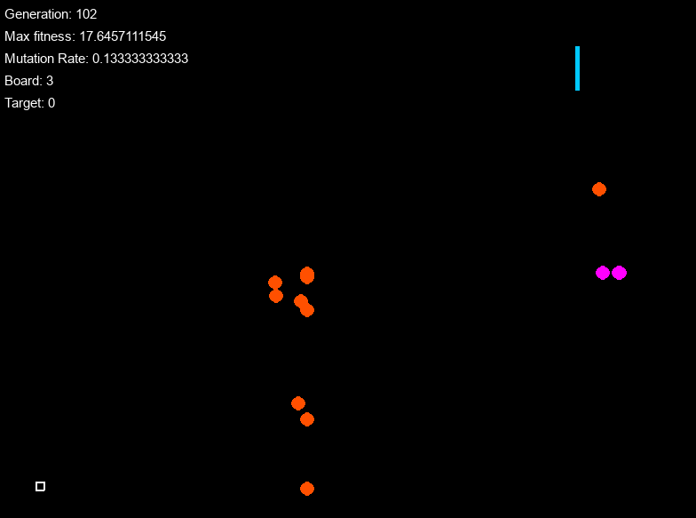

#Smart Target

Simple genetic algorithm project



##Background
I was inspired to try out genetic algorithm by myself after watching this [video](https://www.youtube.com/watch?v=qv6UVOQ0F44&t=176s) on YouTube. My initial idea was to install self-driving cars that learn how to avoid collisions; however, in order to decide actions based on the environment where I cannot define fixed length genes, I needed to pass down the weights of neural network as gene. Before tackling with self-driving cars, I decided to practice genetic algorithm on lower complexity.

For this project, this [website](http://www.blprnt.com/smartrockets/) and this [tutorial](https://www.youtube.com/watch?v=bGz7mv2vD6g) were very helpful.


##Objective
Shoot balls from the launcher (bottom left corner in the image) and try to hit 2 randomly generated targets. The ball will bounce off the first target vertically drawn in the 1st quadrant, and try to hit the second target which is draw horizontally in the 3rd quadrant.

>


##Design
Gene includes three information:
* Mass of the ball
* The initial x velocity
* The initial y velocity

Therefore the gene is represented by a vector of length 3, and store type float value in each element.

Each generation is a sequence of gene (in default, it is 15)
>


##Fitness Function
Here is a pseudo code for the fitness function for this project

```
if the ball does not hit the first target:
  fitness = 1 / distance_from_target1
elif the ball does not hit the second target:
  fitness = 1 + 1 / distance_from_target2
else:
  fitness = 2
```

As shown above, the fitness is 0 - 1 if it does not hit the first
##Natural Selection
Usually genes in genetic algorithm are far more complex than the list with the length of 3. Thus, I ran into the issue by the lack of diversity in early generation, meaning, after a few iterations, all value in genes converge to same value and stopped evolving. In order to increase variety in each generation, I took following steps.

####Step 1
After each generation, evaluate
####Step 2
